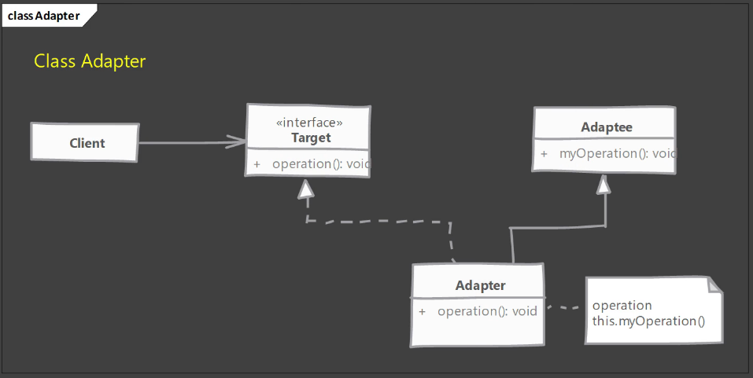
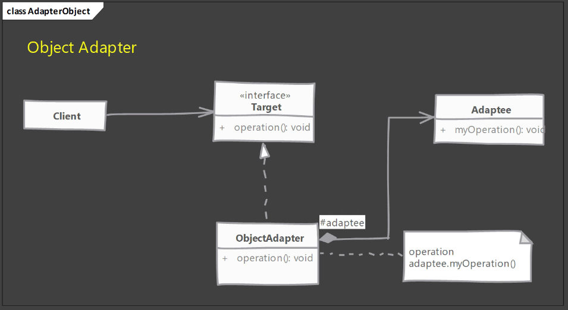

# Adapter-design-pattern

* The Adapter Design Pattern is a structural design pattern that allows two incompatible interfaces to work together. The Adapter Design Pattern is also known as Wrapper.

### The Adapter Design Pattern is used when:

* You want to use an existing class, and its interface does not match the one you need.

* The Adapter Design Pattern allows classes with incompatible interfaces to work together by wrapping its own interface around that of an already existing class.

* The Adapter Design Pattern is often used to make existing classes work with others without modifying their source code.

### The Adapter Design Pattern types:

* Class Adapter: The Adapter Design Pattern is implemented using inheritance. This is called the Class Adapter because the Adapter is implemented as a subclass of the Adaptee. The Adapter overrides some of the Adaptee’s behavior and provides an alternative interface.

* Object Adapter: The Adapter Design Pattern is implemented using composition. This is called the Object Adapter because the Adapter contains an instance of the Adaptee. The Adapter delegates to the Adaptee and provides an alternative interface.

* Default Adapter: The Adapter Design Pattern is implemented using inheritance. This is called the Default Adapter because the Adapter is implemented as a subclass of the Adaptee. The Adapter overrides some of the Adaptee’s behavior and provides an alternative interface. The Adapter also provides default behavior for the interface methods.

* Double Adapter: The Adapter Design Pattern is implemented using composition. This is called the Double Adapter because the Adapter contains two instances of the Adaptee. The Adapter delegates to the Adaptee and provides an alternative interface. The Adapter also provides default behavior for the interface methods.

* Filter Adapter: The Adapter Design Pattern is implemented using composition. This is called the Filter Adapter because the Adapter contains an instance of the Adaptee. The Adapter delegates to the Adaptee and provides an alternative interface. The Adapter also provides default behavior for the interface methods.

* Wrapper Adapter: The Adapter Design Pattern is implemented using composition. This is called the Wrapper Adapter because the Adapter contains an instance of the Adaptee. The Adapter delegates to the Adaptee and provides an alternative interface. The Adapter also provides default behavior for the interface methods.

* Interface Adapter: The Adapter Design Pattern is implemented using inheritance. This is called the Interface Adapter because the Adapter is implemented as a subclass of the Adaptee. The Adapter overrides some of the Adaptee’s behavior and provides an alternative interface. The Adapter also provides default behavior for the interface methods.
 

* Object Adapter: The Adapter Design Pattern is implemented using composition. This is called the Object Adapter because the Adapter contains an instance of the Adaptee. The Adapter delegates to the Adaptee and provides an alternative interface.
